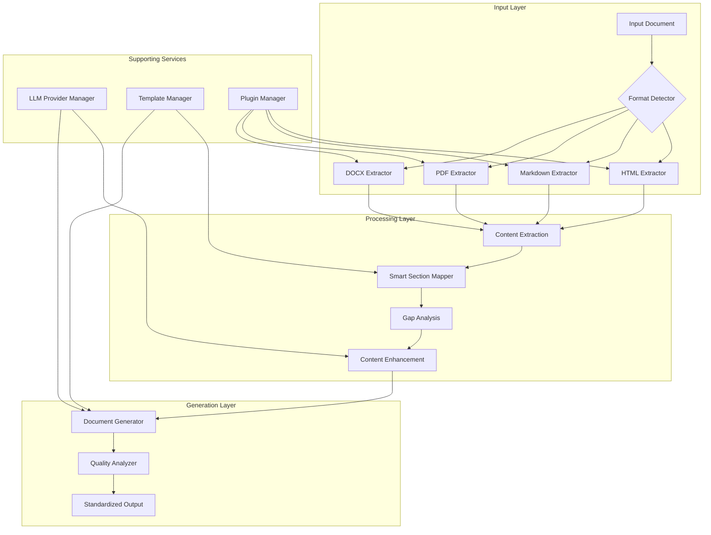
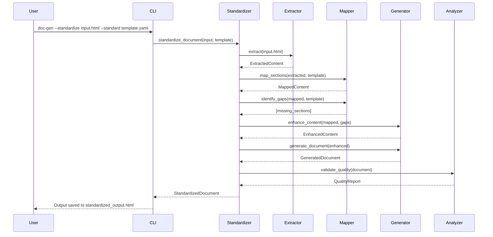
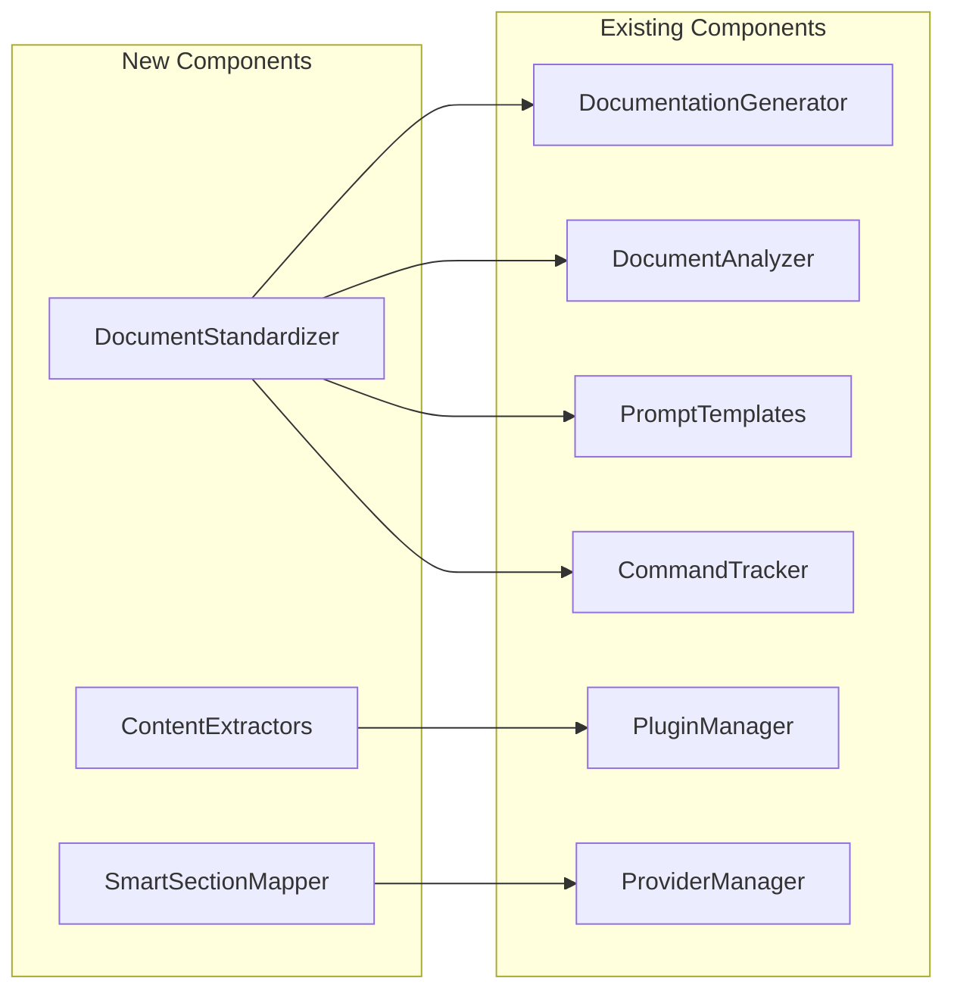

# Document Standardization Feature - Architectural Design

## Executive Summary

This document outlines the architectural design for a new document standardization feature that transforms non-conforming documentation into standardized formats while preserving original knowledge and enhancing content as needed.

## 1. Feature Overview

### Purpose
Enable users to take existing documentation that doesn't follow organizational standards and automatically transform it to match defined templates while:
- Preserving all original knowledge
- Maintaining semantic meaning
- Adding missing required sections
- Enhancing incomplete content
- Supporting multiple input formats

### Use Cases
1. **Legacy Documentation Migration**: Convert old documentation to new standards
2. **Third-Party Documentation Integration**: Standardize external documentation
3. **Cross-Team Standardization**: Unify documentation across different teams
4. **Documentation Quality Improvement**: Upgrade poorly formatted docs

## 2. Architecture Overview



## 3. Component Design

### 3.1 DocumentStandardizer (Core Component)

**Location**: `src/doc_generator/standardizer.py`

```python
class DocumentStandardizer:
    """
    Main orchestrator for document standardization workflow.
    """
    
    def __init__(self, 
                 generator: DocumentationGenerator,
                 analyzer: DocumentAnalyzer,
                 mapper: SmartSectionMapper,
                 extractor_manager: ExtractorManager):
        self.generator = generator
        self.analyzer = analyzer
        self.mapper = mapper
        self.extractor_manager = extractor_manager
    
    def standardize_document(self, 
                            input_path: str,
                            template_path: str,
                            options: StandardizationOptions) -> StandardizedDocument:
        """Main standardization workflow"""
        # 1. Extract content from input document
        extracted = self.extract_content(input_path)
        
        # 2. Map to standard template
        mapped = self.map_to_standard(extracted, template_path)
        
        # 3. Identify and fill gaps
        enhanced = self.enhance_content(mapped, options)
        
        # 4. Generate final document
        standardized = self.generate_standardized(enhanced)
        
        # 5. Quality check
        return self.validate_output(standardized)
```

### 3.2 Content Extractor Plugin System

**Base Interface**: `src/doc_generator/extractors/base.py`

```python
from abc import ABC, abstractmethod
from dataclasses import dataclass
from typing import List, Dict, Optional

@dataclass
class ExtractedContent:
    """Represents extracted document content"""
    title: Optional[str]
    sections: List[Section]
    metadata: Dict[str, any]
    code_blocks: List[CodeBlock]
    tables: List[Table]
    images: List[Image]
    custom_elements: Dict[str, any]

class ContentExtractor(ABC):
    """Abstract base for all content extractors"""
    
    @abstractmethod
    def extract(self, file_path: str) -> ExtractedContent:
        """Extract structured content from document"""
        pass
    
    @abstractmethod
    def get_supported_formats(self) -> List[str]:
        """Return list of supported file extensions"""
        pass
    
    @abstractmethod
    def validate_input(self, file_path: str) -> bool:
        """Validate if file can be processed"""
        pass
```

### 3.3 Smart Section Mapper

**Location**: `src/doc_generator/mapper.py`

```python
class SmartSectionMapper:
    """
    Intelligently maps extracted content to standard template sections.
    Uses semantic similarity and NLP techniques.
    """
    
    def __init__(self, embedding_model: Optional[str] = None):
        self.embedding_model = embedding_model or "text-embedding-ada-002"
        self.similarity_threshold = 0.7
    
    def map_sections(self, 
                     extracted: ExtractedContent,
                     template: DocumentTemplate) -> MappedContent:
        """Map extracted sections to template sections"""
        mappings = {}
        
        for extracted_section in extracted.sections:
            best_match = self.find_best_template_match(
                extracted_section, 
                template.sections
            )
            if best_match:
                mappings[best_match] = extracted_section
        
        return MappedContent(mappings, extracted.custom_elements)
    
    def identify_gaps(self, 
                      mapped: MappedContent,
                      template: DocumentTemplate) -> List[str]:
        """Identify missing required sections"""
        required = set(template.required_sections)
        mapped_sections = set(mapped.mappings.keys())
        return list(required - mapped_sections)
```

## 4. Data Flow Diagram



## 5. Integration Points

### 5.1 Existing Component Reuse



### 5.2 CLI Integration

```yaml
# New CLI arguments
Arguments:
  --standardize: Path to input document to standardize
  --standard: Template or standard to conform to
  --preserve-custom: Keep sections not in template
  --enhance: Add missing information via LLM
  --map-threshold: Similarity threshold for section mapping (0.0-1.0)
  --output-format: Output format (html, markdown)

Example Usage:
  # Basic standardization
  doc-gen --standardize legacy.html --standard fasrc-template.yaml
  
  # With enhancement and custom preservation
  doc-gen --standardize external.md \
          --standard internal-standard.yaml \
          --enhance \
          --preserve-custom \
          --output-format markdown
```

## 6. File Structure

```
doc-generator/
├── src/doc_generator/
│   ├── standardizer.py              # Main standardizer component
│   ├── mapper.py                    # Section mapping logic
│   ├── extractors/                  # Content extractors
│   │   ├── __init__.py
│   │   ├── base.py                  # Abstract base class
│   │   ├── html_extractor.py        # HTML extraction
│   │   ├── markdown_extractor.py    # Markdown extraction
│   │   ├── pdf_extractor.py         # PDF extraction
│   │   └── docx_extractor.py        # Word doc extraction
│   └── templates/                   # Standard templates
│       ├── standards/
│       │   ├── fasrc.yaml
│       │   ├── technical.yaml
│       │   └── api-docs.yaml
│       └── mappings/
│           └── section_mappings.json
├── prompts/
│   └── standardizer/                # Standardization prompts
│       ├── extraction.yaml          # Content extraction prompts
│       ├── mapping.yaml             # Section mapping prompts
│       ├── enhancement.yaml         # Content enhancement prompts
│       └── preservation.yaml        # Knowledge preservation rules
└── tests/
    ├── test_standardizer.py         # Unit tests
    ├── test_extractors.py           # Extractor tests
    ├── test_mapper.py               # Mapper tests
    └── fixtures/
        └── standardizer/
            ├── sample_inputs/       # Test input documents
            ├── expected_outputs/    # Expected results
            └── templates/           # Test templates
```

## 7. Testing Strategy

### 7.1 Unit Testing

```python
# tests/test_standardizer.py
class TestDocumentStandardizer:
    def test_extract_html_content(self):
        """Test HTML content extraction"""
        
    def test_extract_markdown_content(self):
        """Test Markdown content extraction"""
        
    def test_map_sections_high_similarity(self):
        """Test section mapping with clear matches"""
        
    def test_map_sections_low_similarity(self):
        """Test section mapping with ambiguous content"""
        
    def test_identify_missing_sections(self):
        """Test gap identification"""
        
    def test_enhance_missing_content(self):
        """Test content enhancement via LLM"""
        
    def test_preserve_custom_sections(self):
        """Test preservation of non-standard sections"""
```

### 7.2 Integration Testing

```python
# tests/test_standardizer_integration.py
class TestStandardizerIntegration:
    def test_full_workflow_html_to_markdown(self):
        """Test complete standardization HTML -> Markdown"""
        
    def test_full_workflow_with_enhancement(self):
        """Test standardization with content enhancement"""
        
    def test_multiple_format_inputs(self):
        """Test various input format handling"""
        
    def test_performance_large_document(self):
        """Test performance with large documents"""
```

### 7.3 Test Coverage Matrix

| Component | Unit Tests | Integration Tests | E2E Tests |
|-----------|------------|------------------|-----------|
| DocumentStandardizer | ✓ | ✓ | ✓ |
| ContentExtractors | ✓ | ✓ | ✓ |
| SmartSectionMapper | ✓ | ✓ | ✓ |
| CLI Integration | ✓ | ✓ | ✓ |
| LLM Enhancement | ✓ | ✓ | - |
| Quality Validation | ✓ | ✓ | ✓ |

## 8. Configuration

### 8.1 Settings Schema

```yaml
# config/standardization.yaml
standardization:
  # Extraction settings
  extraction:
    max_file_size: 10485760  # 10MB
    supported_formats:
      - html
      - md
      - pdf
      - docx
    timeout: 30  # seconds
  
  # Mapping settings
  mapping:
    similarity_threshold: 0.7
    embedding_model: "text-embedding-ada-002"
    fuzzy_match_enabled: true
    custom_section_prefix: "custom_"
  
  # Enhancement settings
  enhancement:
    model: "gpt-4"
    temperature: 0.3
    max_tokens: 2000
    add_examples: true
    add_references: true
  
  # Output settings
  output:
    include_metadata: true
    include_mapping_report: false
    validation_required: true
```

## 9. Implementation Roadmap

### Phase 1: Foundation (Week 1-2)
- [ ] Create base extractor interface
- [ ] Implement HTML extractor
- [ ] Build DocumentStandardizer core
- [ ] Basic CLI integration

### Phase 2: Mapping Intelligence (Week 3-4)
- [ ] Implement SmartSectionMapper
- [ ] Add semantic similarity matching
- [ ] Create gap analysis logic
- [ ] Build content preservation system

### Phase 3: Enhancement (Week 5-6)
- [ ] LLM integration for enhancement
- [ ] Prompt template development
- [ ] Quality validation integration
- [ ] Performance optimization

### Phase 4: Extended Format Support (Week 7-8)
- [ ] Markdown extractor
- [ ] PDF extractor
- [ ] DOCX extractor
- [ ] Format auto-detection

### Phase 5: Testing & Polish (Week 9-10)
- [ ] Comprehensive test suite
- [ ] Performance benchmarking
- [ ] Documentation
- [ ] CLI refinements

## 10. Success Metrics

### Functional Metrics
- **Format Support**: Support for 4+ input formats
- **Mapping Accuracy**: >85% correct section mapping
- **Content Preservation**: 100% original content retained
- **Enhancement Quality**: >4.0/5.0 quality score

### Performance Metrics
- **Processing Speed**: <30s for average document
- **Memory Usage**: <500MB for typical operation
- **Batch Processing**: Support for 100+ documents
- **Error Rate**: <1% failure rate

### User Experience Metrics
- **CLI Usability**: Single command operation
- **Configuration**: Minimal required configuration
- **Output Quality**: Professional, consistent formatting
- **Feedback**: Clear progress and error messages

## 11. Risk Mitigation

| Risk | Impact | Mitigation Strategy |
|------|--------|-------------------|
| Poor section mapping | High | Use multiple similarity metrics, allow manual mapping overrides |
| Content loss | High | Implement strict validation, always preserve original |
| Performance issues | Medium | Implement caching, optimize LLM calls, add batch processing |
| Format compatibility | Medium | Extensive testing, graceful degradation for unsupported elements |
| LLM hallucination | Medium | Use low temperature, validate against original content |

## 12. Future Enhancements

1. **Machine Learning Improvements**
   - Train custom embedding model for documentation
   - Fine-tune mapping model on user corrections
   - Implement learning from user feedback

2. **Advanced Features**
   - Multi-document standardization
   - Cross-reference preservation
   - Version control integration
   - Batch processing UI

3. **Enterprise Features**
   - Custom organizational templates
   - Compliance checking
   - Audit trails
   - API endpoint for standardization service

## Appendix A: Example Transformations

### Before (Non-standard HTML)
```html
<div class="content">
  <h3>Getting Started</h3>
  <p>This is how you use our API...</p>
  <h3>Authentication</h3>
  <p>Use your API key...</p>
</div>
```

### After (Standardized Markdown)
```markdown
# API Documentation

## Description
Professional API documentation following organizational standards.

## Installation
```bash
pip install api-client
```

## Usage
This is how you use our API...

## Authentication
Use your API key for authentication:
- Obtain key from dashboard
- Include in headers
- Handle expiration

## Examples
[Enhanced with generated examples]

## References
[Added standard references]
```

## Appendix B: Command Examples

```bash
# Basic standardization
doc-gen --standardize old-docs.html --standard fasrc-template.yaml

# With all options
doc-gen --standardize legacy.pdf \
        --standard technical-template.yaml \
        --enhance \
        --preserve-custom \
        --map-threshold 0.8 \
        --output-format markdown \
        --output-dir ./standardized/

# Batch processing
doc-gen --standardize-dir ./old-docs/ \
        --standard company-standard.yaml \
        --recursive \
        --enhance
```

---

*Document Version: 1.0*  
*Last Updated: 2025-01-20*  
*Author: System Architecture Team*