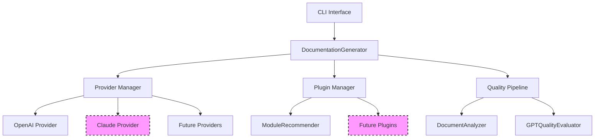

# Design Documentation

This section contains architectural decisions, design specifications, and technical documentation for the doc-generator project.

## 📐 Design Principles

The doc-generator project follows these core design principles:

### **Modularity**
- Plugin-based architecture for extensibility
- Provider abstraction for multiple AI services
- Separation of concerns between generation, analysis, and evaluation

### **Backward Compatibility**
- New features don't break existing functionality
- Configuration changes are additive
- API changes follow semantic versioning

### **Quality Focus**
- Multi-run generation with quality evaluation
- Comprehensive testing at unit and integration levels
- Documentation-driven development

### **User Experience**
- Simple CLI for basic usage
- Advanced options for power users
- Clear error messages and helpful defaults

---

## 📋 Design Documents

| Document | Status | Description |
|----------|--------|-------------|
| [Claude API Integration](claude-api-integration.md) | 🚧 Draft | Adding Anthropic Claude alongside OpenAI |
| Plugin Architecture v2 | 💭 Planned | Enhanced plugin system with better discovery |
| Multi-Provider Strategy | 💭 Planned | Framework for supporting multiple LLM providers |

---

## 🎯 Architecture Overview

*Dashed components are planned/in development*

---

## 📝 Decision Records

### **ADR-001: Plugin Architecture**
- **Status**: Implemented
- **Decision**: Use Python entry points for plugin discovery
- **Rationale**: Standard Python mechanism, automatic discovery, easy packaging

### **ADR-002: Provider Abstraction**
- **Status**: Planned
- **Decision**: Create provider abstraction layer for multiple LLM services
- **Rationale**: Support multiple AI providers without breaking existing code

### **ADR-003: Configuration Management**
- **Status**: Implemented
- **Decision**: YAML-based configuration with environment variable overrides
- **Rationale**: Human-readable, version-controllable, flexible

---

## 🔄 Design Process

Our design process follows these steps:

1. **Problem Identification** - Document the issue or feature need
2. **Requirements Gathering** - Define functional and non-functional requirements
3. **Architecture Design** - Create high-level design with alternatives
4. **Technical Specification** - Detailed implementation plan
5. **Review & Feedback** - Team review and community input
6. **Implementation** - Develop with tests and documentation
7. **Post-Implementation Review** - Evaluate outcomes and lessons learned

---

## 📚 References

- [Architectural Decision Records (ADRs)](https://adr.github.io/)
- [Design by Contract](https://en.wikipedia.org/wiki/Design_by_contract)
- [Plugin Architecture Patterns](https://www.martinfowler.com/articles/plugins.html)
- [Provider Pattern](https://en.wikipedia.org/wiki/Provider_model)