# Token Usage Analysis for doc-generator

## Executive Summary

This document provides comprehensive analysis of token usage patterns, consumption metrics, and cost projections for the doc-generator system across different LLM providers and operation types.

---

## Token Consumption by Operation Type

### Overview of Token Usage per Operation

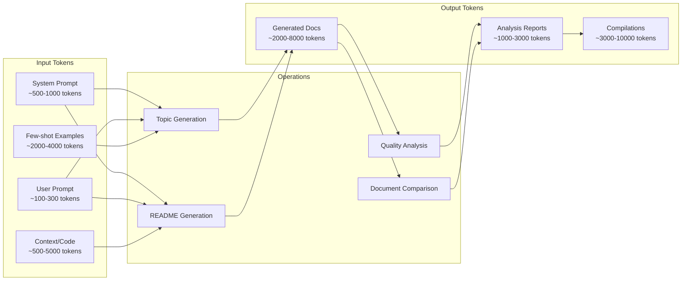

### Token Distribution by Operation

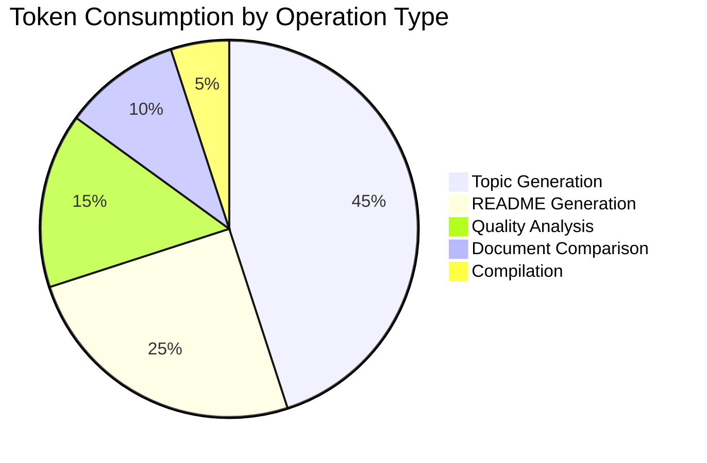

### Detailed Token Breakdown

| Operation | Input Tokens | Output Tokens | Total per Run | Multi-run (×3) |
|-----------|-------------|---------------|---------------|----------------|
| **Topic Generation** | 3,000-6,000 | 2,000-8,000 | 5,000-14,000 | 15,000-42,000 |
| **README Generation** | 2,000-8,000 | 1,500-5,000 | 3,500-13,000 | 10,500-39,000 |
| **Quality Analysis** | 2,500-9,000 | 1,000-3,000 | 3,500-12,000 | 10,500-36,000 |
| **Document Comparison** | 4,000-12,000 | 1,500-4,000 | 5,500-16,000 | 16,500-48,000 |
| **Compilation** | 6,000-20,000 | 3,000-10,000 | 9,000-30,000 | N/A |

---

## Provider-Specific Token Usage

### Token Limits and Pricing by Model

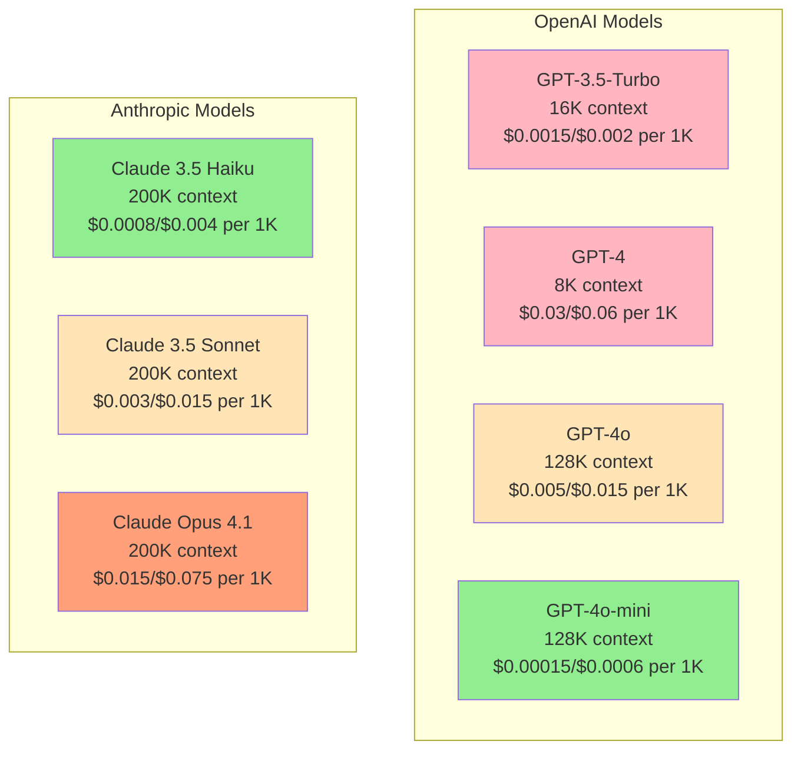

### Cost Efficiency Matrix

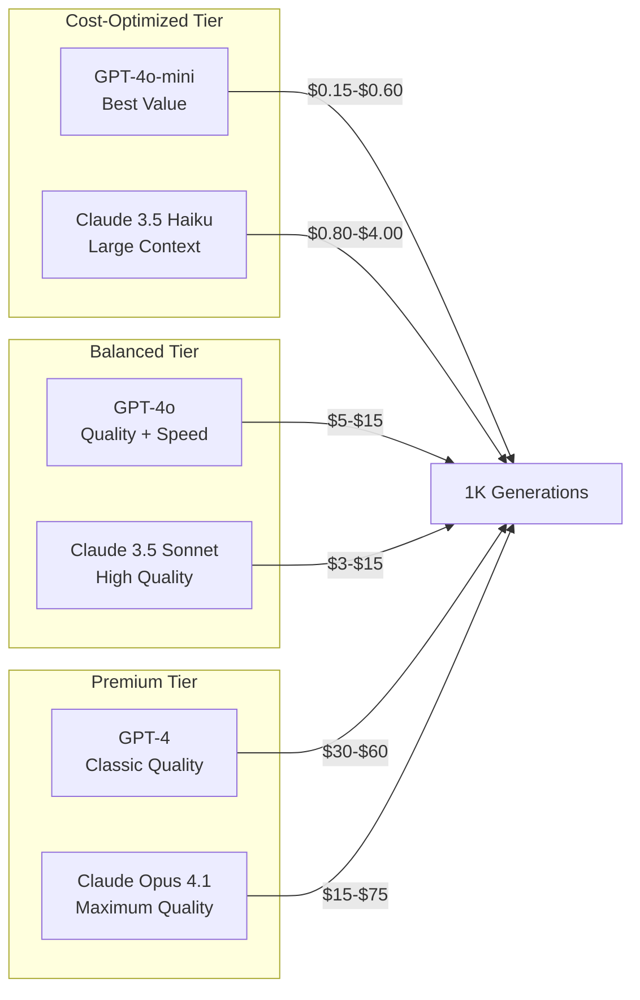

---

## Token Usage Timeline and Projections

### Monthly Token Consumption Growth

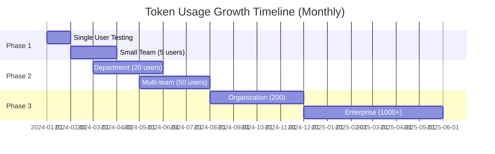

### Projected Token Consumption Over Time

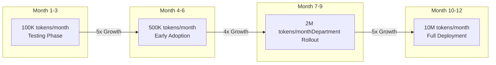

### Daily Token Usage Patterns

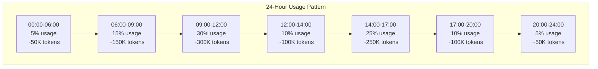

---

## Token Optimization Strategies

### Optimization Hierarchy

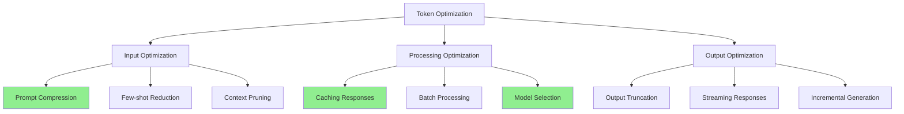

### Token Savings by Strategy

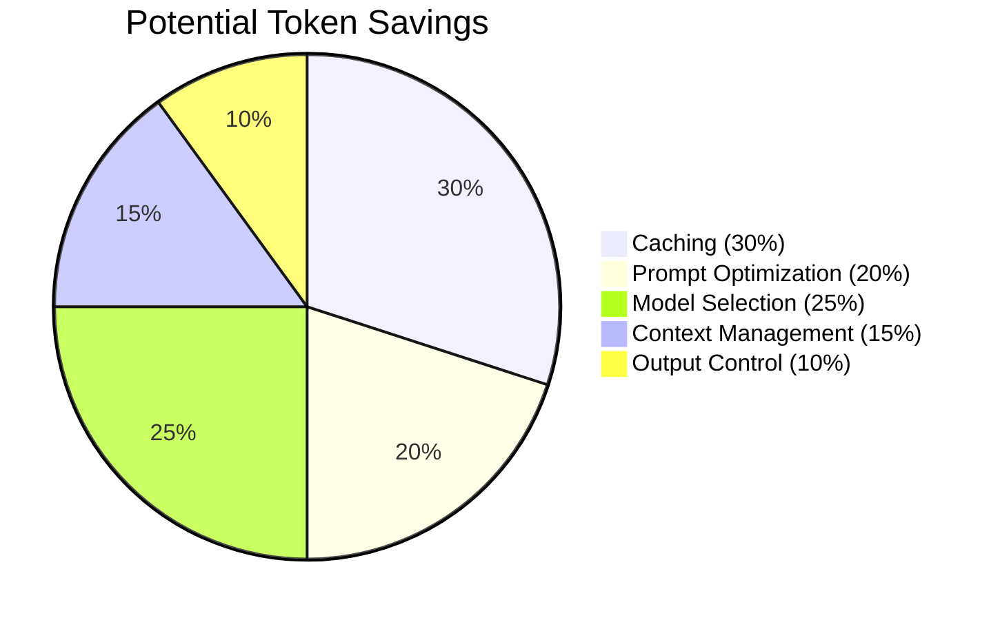

---

## Cost Analysis and Projections

### Monthly Cost by User Tier

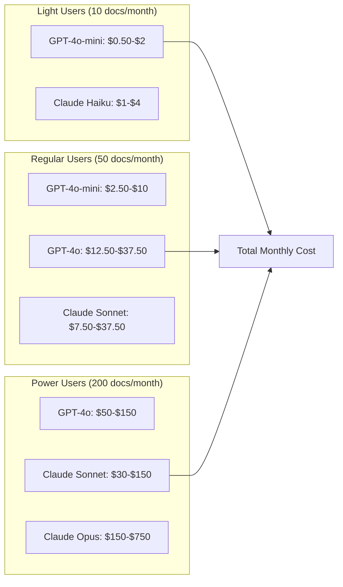

### Annual Token Budget Planning

| User Segment | Users | Tokens/Month | Annual Tokens | Estimated Cost (GPT-4o-mini) | Estimated Cost (GPT-4o) |
|--------------|-------|--------------|---------------|-------------------------------|-------------------------|
| Light | 100 | 10M | 120M | $1,200-$4,800 | $6,000-$18,000 |
| Regular | 50 | 25M | 300M | $3,000-$12,000 | $15,000-$45,000 |
| Power | 10 | 20M | 240M | $2,400-$9,600 | $12,000-$36,000 |
| **Total** | **160** | **55M** | **660M** | **$6,600-$26,400** | **$33,000-$99,000** |

---

## Token Usage Monitoring Dashboard

### Key Metrics to Track

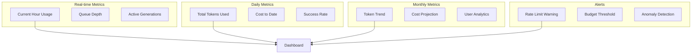

### Token Usage by Feature (WebUI Projected)

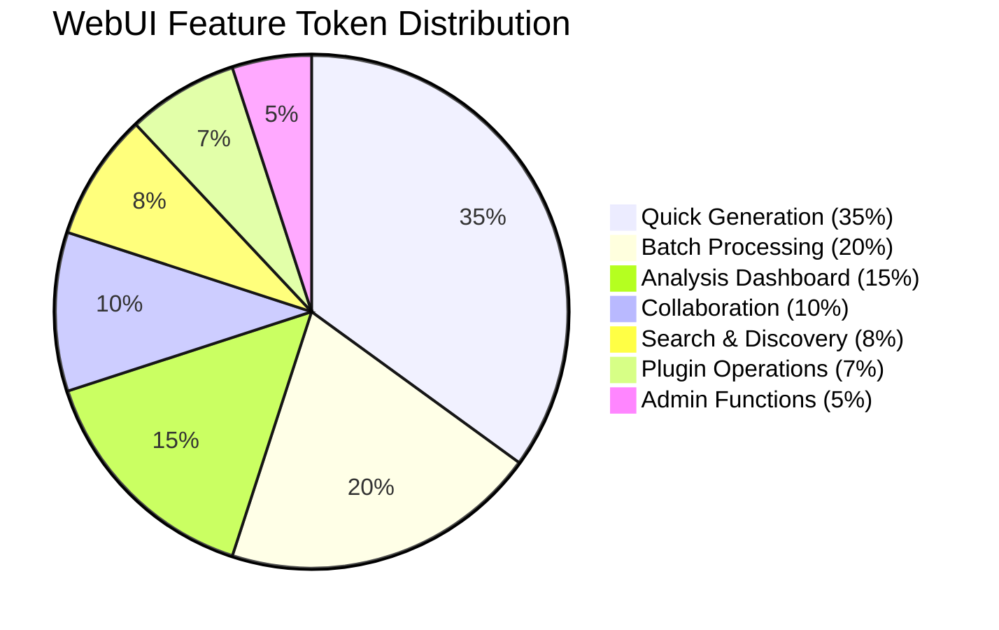

---

## Optimization Recommendations

### Priority Matrix

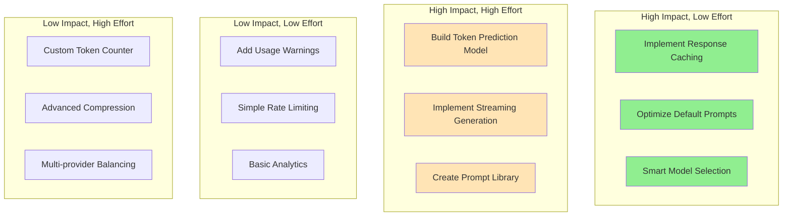

### Implementation Timeline

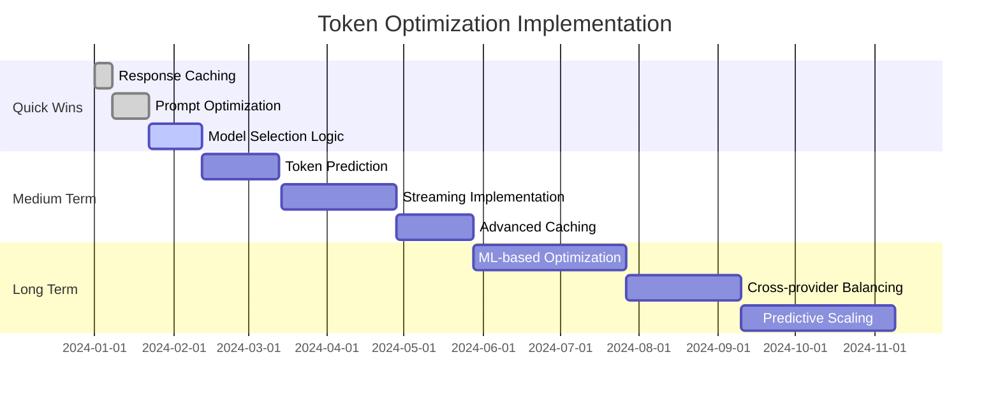

---

## Token Usage Best Practices

### For Developers

1. **Always cache repeated operations** - 30% token savings
2. **Use appropriate models** - GPT-4o-mini for drafts, GPT-4o for production
3. **Implement progressive generation** - Generate summaries first, then details
4. **Batch similar requests** - Combine multiple small requests
5. **Monitor token usage in CI/CD** - Catch expensive operations early

### For End Users

1. **Start with lighter models** - Upgrade only when needed
2. **Use templates and examples** - Reduces input tokens
3. **Review and refine prompts** - Iterative improvement saves tokens
4. **Leverage caching** - Reuse previous generations when possible
5. **Set budget alerts** - Monitor consumption proactively

### For Administrators

1. **Implement tiered access** - Different models for different user groups
2. **Set rate limits** - Prevent runaway consumption
3. **Monitor usage patterns** - Identify optimization opportunities
4. **Regular cost reviews** - Adjust strategies based on actual usage
5. **Educate users** - Token awareness training

---

## Conclusion

### Key Findings

- **Token usage varies 3-10x** depending on operation type and model selection
- **Caching can reduce consumption by 30%** for repeated operations
- **Model selection has the biggest cost impact** - up to 100x difference
- **WebUI will increase usage 5-10x** but enable better optimization
- **Annual costs range from $6K-$99K** depending on model and usage patterns

### Recommended Actions

1. **Immediate**: Implement response caching and prompt optimization
2. **Short-term**: Deploy smart model selection based on task complexity
3. **Medium-term**: Build token prediction and monitoring dashboard
4. **Long-term**: Develop ML-based optimization and predictive scaling

### Success Metrics

- Token usage per document: Target < 10K average
- Cache hit rate: Target > 30%
- Cost per user per month: Target < $10 for regular users
- Generation success rate: Target > 95%
- User satisfaction with speed/quality trade-off: Target > 85%

---

*Last Updated: 2024-01-27*
*Next Review: 2024-02-27*