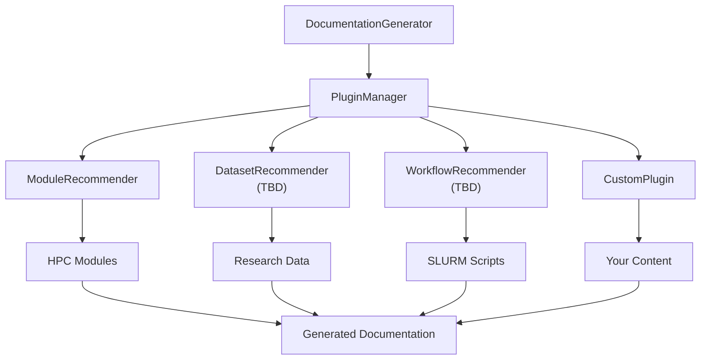

# doc-generator

> **AI-powered documentation generator with extensible plugin architecture**

[](https://www.python.org/downloads/)
[](https://opensource.org/licenses/MIT)
[](guides/testing.md)

---

## What is doc-generator?

**doc-generator** is a sophisticated Python package that automates the creation of high-quality technical documentation using multiple LLM providers (OpenAI GPT and Anthropic Claude). Originally designed for Faculty Arts and Sciences Research Computing (FASRC), it supports three main capabilities: generating documentation from topics, creating README files for code projects, and standardizing existing documentation to organizational templates.

!!! example "Quick Examples"
    === "Topic Documentation"
        ```bash
        # Generate comprehensive documentation in seconds
        doc-gen --topic "Python Machine Learning with GPU" --output-dir ./docs
        
        # Result: Professional HTML documentation with:
        # HPC module recommendations (python/3.12.8, cuda/12.9.1)
        # Installation instructions
        # Code examples and workflows
        # Best practices and troubleshooting
        ```
    
    === "README Generation"
        ```bash
        # Generate README for your project directory
        doc-gen --readme /path/to/project --recursive --output-dir ./output
        
        # Result: README.md files with:
        # Project structure analysis
        # Code example discovery
        # Installation and usage instructions
        # AI-enhanced descriptions
        ```
    
    === "Document Standardization"
        ```bash
        # Standardize existing documentation
        doc-gen --standardize legacy-docs.html --template technical_documentation
        
        # Result: Standardized markdown with:
        # Organizational template structure
        # Consistent formatting and sections
        # Format conversion (HTML → Markdown)
        # Content preservation and enhancement
        ```

---

## Key Features

### **Multi-Provider AI Integration**
- **OpenAI GPT Models** (GPT-3.5-Turbo, GPT-4, GPT-4o, GPT-4o-mini) with customizable parameters
- **Anthropic Claude Models** (Claude 3.5 Sonnet, Claude Opus 4.1, Claude 3.5 Haiku) for advanced AI capabilities
- **Intelligent Model Selection** with production-ready recommendations and known limitation warnings
- **Auto-Provider Selection** based on available API keys, task types, and optimal model routing
- **Few-shot Prompting** with curated examples for consistent, high-quality output
- **Multiple Format Support** including HTML, Markdown, and custom formats

### **Extensible Plugin Architecture**
- **Built-in ModuleRecommender** suggests relevant HPC modules automatically
- **Third-party Plugin Support** via Python entry points for unlimited extensibility
- **Priority-based Ordering** and intelligent plugin management
- **Community Ecosystem** ready for datasets, workflows, code templates, and more

### **Quality Assurance Pipeline**
- **Multi-run Generation** with temperature variation for optimal results
- **Algorithmic Analysis** with section scoring and structure validation
- **GPT-based Quality Evaluation** for technical accuracy assessment
- **Best-variant Compilation** automatically selects optimal content

### **Documentation Comparison**
- **Compare with References** to benchmark quality against existing documentation
- **7 Similarity Metrics** including content, structural, semantic, and code similarity
- **Intelligent Recommendations** for improving generated documentation
- **Platform Detection** works with Sphinx, MkDocs, ReadTheDocs, GitHub, and more

### **Document Standardization System**
- **Legacy Document Transformation** converts existing documentation to modern standards
- **Organizational Templates** for technical documentation, user guides, and API references
- **Smart Content Mapping** uses AI to organize content into standardized sections
- **Format Conversion** between HTML, Markdown, and other formats with fidelity preservation
- **Extensible Extractor Architecture** supports multiple input document formats

### **Professional Development Tools**
- **Comprehensive CLI** with 20+ command-line options for all operation modes
- **Python API** for programmatic integration and custom workflows
- **Code Scanning** for automatic example discovery in project directories
- **README Generation** for code projects with recursive directory support
- **Batch Processing** capabilities for documentation sets and migration workflows

---

## Perfect For

<div class="grid cards" markdown>

-   :material-school: **Research Computing**

    ---

    Generate HPC user guides, software documentation, and cluster tutorials with intelligent module recommendations.

-   :material-code-braces: **Software Development**

    ---

    Create API documentation, installation guides, and user manuals with automatic code example discovery.

-   :material-rocket-launch: **DevOps & Infrastructure**

    ---

    Build deployment guides, configuration documentation, and troubleshooting resources.

-   :material-library: **Academic Documentation**

    ---

    Produce research methodology docs, software tutorials, and reproducible workflow guides.

</div>

---

## Quick Start

### Installation

=== "Development Install"

    ```bash
    # Clone and install for development
    git clone https://github.com/fasrc/doc-fun.git
    cd doc-fun
    pip install -e ".[dev]"
    
    # Verify installation
    doc-gen --version
    doc-gen --list-plugins
    ```

=== "Production Install"

    ```bash
    # Install from PyPI (coming soon)
    pip install doc-generator
    
    # Set up environment
    echo "OPENAI_API_KEY=your-key" > .env
    ```

### Your First Documentation

```bash
# 1. Set your OpenAI API key
export OPENAI_API_KEY="your-api-key-here"

# 2. Generate documentation
doc-gen --topic "Python Data Analysis with Pandas" --output-dir ./my-docs

# 3. View the results
open my-docs/python_data_analysis_with_pandas_gpt-4o-mini_temp03.html
```

!!! success "What You Get"
    Your generated documentation will include:
    
    - **Intelligent Module Recommendations**: `module load python/3.12.8-fasrc01`, `module load gcc/12.2.0-fasrc01`
    - **Structured Content**: Description, Installation, Usage, Examples, References
    - **Professional Formatting**: Clean HTML with syntax highlighting
    - **Context-Aware Suggestions**: HPC-specific commands and best practices

---

## Architecture Overview

### Plugin System

The heart of doc-generator is its extensible plugin architecture:



### Package Structure

```
src/doc_generator/
├── __init__.py              # Package exports  
├── core.py                  # DocumentationGenerator class
├── cli.py                   # Command-line interface
├── plugin_manager.py        # Plugin discovery & management
└── plugins/
    ├── base.py             # RecommendationEngine interface
    └── modules.py          # Built-in ModuleRecommender
```

---

## Plugin Ecosystem

### Built-in Plugins

| Plugin | Purpose | Status |
|--------|---------|--------|
| **ModuleRecommender** | HPC module suggestions | Available |
| **DatasetRecommender (TBD)** | Research dataset discovery | Community |
| **WorkflowRecommender (TBD)** | SLURM job templates | Community |
| **CodeTemplateRecommender (TBD)** | Boilerplate code | Community |

### Create Your Own Plugin

```python
from doc_generator.plugins import RecommendationEngine

class MyAwesomePlugin(RecommendationEngine):
    def get_name(self) -> str:
        return "awesome"
    
    def get_recommendations(self, topic: str, context=None):
        # Your recommendation logic here
        return [{
            "title": "Awesome Suggestion",
            "description": "This will help with " + topic,
            "relevance_score": 9.5
        }]
```

!!! tip "Plugin Development"
    Check out our comprehensive [Creating Plugins Guide](guides/creating-plugins.md) for step-by-step instructions, complete examples, and best practices.

---

## Quality & Testing

### Test Coverage
- **57 comprehensive tests** covering all functionality
- **Plugin system integration** tests
- **Error handling validation** for robustness
- **Mock systems** for external dependencies

### Quality Pipeline
- **Multi-run generation** with temperature variation
- **Algorithmic scoring** of structure and content
- **GPT-based evaluation** for technical accuracy
- **Best compilation** selection

```bash
# Run the full test suite
python -m pytest -v

# Generate with quality analysis
doc-gen --topic "Critical Documentation" --runs 3 --analyze --quality-eval
```

---

## Learning Path

<div class="grid cards" markdown>

-   :material-rocket: **[Installation Guide](guides/installation.md)**

    ---

    Set up doc-generator with all dependencies, virtual environments, and configuration.

-   :material-play: **[Getting Started](guides/getting-started.md)**

    ---

    Learn basic usage, command-line options, and your first documentation generation.

-   :material-test-tube: **[Testing Guide](guides/testing.md)**

    ---

    Understand the test suite, run tests, and write new test cases.

-   :material-puzzle: **[Creating Plugins](guides/creating-plugins.md)**

    ---

    Build custom recommendation engines and extend doc-generator's capabilities.

</div>

---

## Community & Support

### Get Involved
- **[GitHub Repository](https://github.com/fasrc/doc-fun)** - Source code and issue tracking
- **[Bug Reports](https://github.com/fasrc/doc-fun/issues)** - Report issues and request features  
- **[FASRC Research Computing](https://www.rc.fas.harvard.edu/)** - Original development team

### Contributing
1. Fork the repository
2. Create a feature branch: `git checkout -b feature/amazing-plugin`
3. Run tests: `python -m pytest -v`
4. Submit a pull request

---

## Success Stories

!!! quote "Research Computing Team"
    "doc-generator transformed how we create user documentation. What used to take hours now takes minutes, and the quality is consistently professional."

!!! quote "Software Developer"  
    "The plugin architecture is brilliant. I created a custom dataset recommender in 30 minutes that saves our team hours every week."

!!! quote "Academic Researcher"
    "Finally, documentation that includes the exact module commands I need. No more digging through wikis and forums."

---

## What's Next?

### Upcoming Features
- **Caching System** for faster repeated generations
- **WordPress Integration** for direct publishing
- **Batch Processing UI** for documentation sets
- **Quality Optimization** with A/B testing
- **Community Plugin Registry** for easy discovery

### Version Roadmap

=== "v1.1.0 (Current)"
    - Plugin architecture
    - CLI interface  
    - Enhanced testing (57 tests)
    - Professional packaging

=== "v1.2.0 (Planned)"
    - Caching system
    - WordPress integration
    - UI improvements
    - Additional plugins

=== "v2.0.0 (Future)"
    - Multi-model support
    - Real-time collaboration
    - Advanced analytics
    - Enterprise features

---

**Ready to transform your documentation workflow?** 

[Get Started Now](guides/installation.md){ .md-button .md-button--primary } [View on GitHub](https://github.com/fasrc/doc-fun){ .md-button }

---

*Built by [FASRC Research Computing](https://www.rc.fas.harvard.edu/)*